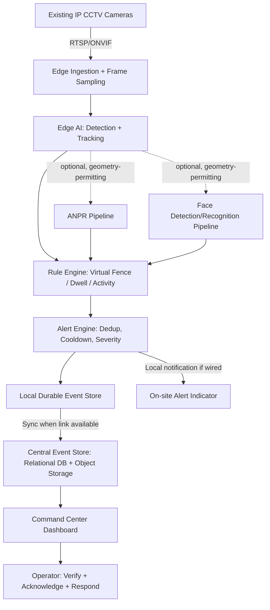

# IBVAP — Deep Red-Team & Architecture Review
### Intelligent Border Video Analytics Platform (SIH 2026, PS 26187)

> This document attacks the previously proposed IBVAP architecture, then rebuilds it. Anything not explicitly stated in the problem statement or verifiable is marked **REQUIRES VALIDATION**.

---

## 1–2. RE-UNDERSTANDING THE PROBLEM

**Facts from the problem statement**
- Border forces (SSB) already have IP CCTV at BOPs, check posts, roads.
- Current systems only record/livestream — no automated intelligence.
- Dedicated FRS/ANPR/smart-camera hardware is expensive and hard to scale to remote posts.
- Desired capabilities: human detection/tracking, vehicle detection/classification, face detection, ANPR, virtual fence, suspicious activity, night detection, real-time alerts, event logging, C2 integration.

**Assumptions (not stated, must be inferred)**
- Cameras are IP/ONVIF-compatible and RTSP-capable — **REQUIRES VALIDATION** (SSB may have analog cameras with DVR/NVR bridges, or mixed vendors).
- Some form of local compute exists at or near each BOP — **REQUIRES VALIDATION**.
- Connectivity between BOPs and a central command center is intermittent, not absent — **REQUIRES VALIDATION** (some BOPs may have zero WAN link).
- Operators are trained security personnel, not IT staff — reasonable inference, standard for BSF/SSB.

**Root cause of the actual operational problem:** cameras produce video, not intelligence — every frame requires a human to watch it. The real problem is a *human-attention bottleneck*, not a lack of footage.

**What must be real-time vs asynchronous**
- Real-time: intrusion, virtual fence breach, suspicious loitering, vehicle stop in restricted zone.
- Near-real-time (seconds delay acceptable): ANPR match, face-detection flag.
- Asynchronous: analytics dashboards, historical search, model retraining, dataset curation.

**Hidden requirements**
- Chain-of-custody / tamper-evidence for evidence used in security/legal follow-up.
- Graceful degradation when a capability cannot run reliably (rather than silent failure).
- Explainability — an operator must be able to see *why* an alert fired, not just get a number.
- Bandwidth-aware design: BOPs are explicitly "remote" — this is a network-constrained system first, an AI system second.

---

## 3. CHALLENGING THE "EXISTING CCTV" ASSUMPTION

Not every capability is achievable on arbitrary existing hardware. This is the single biggest risk in the original proposal, which implicitly assumed uniform camera quality.

| Capability | CCTV Requirement | Realistic Model | Key Limitation | Failure Condition | Fallback |
|---|---|---|---|---|---|
| Human detection | ≥480p, ≥5–10 fps, daylight or IR | YOLOv8n/s | Small/distant persons missed | Object <20px tall | Flag as "low-confidence motion", not "human" |
| Human tracking | Stable fps, minimal frame drops | ByteTrack | ID switches on occlusion/crowding | Network jitter drops frames | Re-identify via appearance embedding within N sec window |
| Vehicle detection | Similar to human, wider FOV helps | YOLOv8 fine-tuned | Confuses similar vehicle classes at distance | Heavy fog/rain | Detect "vehicle" generically, skip classification |
| Vehicle classification | Closer range, side/front profile | Fine-tuned classifier head | Needs labeled local data (military vs civilian) | Oblique angle | Downgrade to "vehicle detected, class uncertain" |
| Face detection | ≥720p, near-frontal, <15–20m distance for most CCTV lenses | RetinaFace/SCRFD | Most CCTV is wide-angle/overhead — faces rarely usable | Face <20–30px | Log "person present", skip face pipeline |
| Face **recognition** | Needs face detection quality + enrolled gallery | ArcFace-style embeddings | Existing wide-FOV CCTV is usually **not adequate** for reliable 1:N matching at range | Any of the above | Present as "possible match, needs human verification" — never auto-confirm identity |
| ANPR | Plate must occupy enough pixels (rule of thumb ~15–20px char height), near-perpendicular angle | Plate detector + OCR | Existing wide-area CCTV rarely captures plates well unless a dedicated choke point/angle exists | Oblique/far plates | Report low-confidence text or "plate undetected" |
| Virtual fence | Static camera, calibrated FOV | Geometry over tracker output | Breaks if camera is bumped/re-aimed | Camera moved | Auto-disable zone + alert operator to recalibrate |
| Suspicious activity | Depends on defined event, not "AI understanding behavior" | Rule engine over tracks | Vague definitions produce meaningless output | Undefined behavior | Restrict to explicitly defined, measurable events (Section 13) |
| Night detection | IR illumination or thermal; plain RGB CCTV is poor at night | Motion + detector tuned for IR/thermal | Plain RGB CCTV at night is close to useless beyond silhouette/motion | No IR/thermal source | Degrade to "motion detected" only, explicitly labeled lower confidence |

**Conclusion:** Face recognition and ANPR **cannot be promised as general capabilities across arbitrary existing CCTV** — they require specific optical conditions (angle, resolution, distance) that most border-perimeter cameras were never installed to satisfy. The system must present these as *conditional* capabilities, active only where camera geometry supports them, not a blanket platform feature.

---

## 4–5. AI/ML ARCHITECTURE — DO WE EVEN NEED AI, PER FEATURE?

| Feature | AI needed? | Justification |
|---|---|---|
| Human/vehicle detection | Yes | No reliable classical CV substitute at this generality |
| Tracking | Yes (lightweight) | ByteTrack is cheap and mostly geometric, not deep-model heavy |
| Virtual fence | **No** — geometry only | Line/polygon intersection on tracker centroids; AI only supplies the "object" input |
| Night movement | Mostly **no** | Background-subtraction motion detection + existing detector is enough; no dedicated "night AI" needed |
| Suspicious activity | **Hybrid** | Deterministic rules (dwell time, zone entry, wrong-direction movement) over tracker output; avoid black-box "behavior AI" |
| ANPR | Yes, but modest | Plate detector (small model) + OCR (PaddleOCR/EasyOCR); no need for large models |
| Face recognition | Yes, but scoped | Only run where camera geometry supports it; never used for autonomous decisions |

**Principle applied:** AI is used only where no deterministic alternative exists (detection, OCR, face embeddings). Everything downstream of "what/where is the object" is rule-based, explainable, and cheap to run/audit — this also reduces GPU load and false-positive fatigue.

**Per-model engineering trade-offs (summary)**

| Model | Edge-Suitable? | Approx. Size | Notes |
|---|---|---|---|
| YOLOv8n/s (person/vehicle) | Yes (Jetson/OpenVINO) | 6–25MB | Needs quantization (INT8/ONNX/TensorRT) for real edge boxes |
| ByteTrack | Yes | Negligible compute | CPU-feasible |
| Plate detector + PaddleOCR | Marginal on low-end edge | ~50–100MB combined | May need to run centrally for low-end boxes |
| RetinaFace/SCRFD | Yes (small variant) | ~2–5MB | Fine on edge |
| Face embedding (ArcFace-class) | Marginal on low-end edge | ~90MB+ | Better run at a regional hub, not the lowest-tier BOP box |

All accuracy/latency figures above are **typical ranges from public benchmarks, not measured on this deployment — REQUIRES VALIDATION** on actual target hardware and footage.

---

## 6–7. PIPELINE, SCALE, AND EDGE VS CENTRAL

**Pipeline stages:** CCTV → RTSP ingestion → frame sampling → detection → tracking → event/rule engine → alert engine → local store → sync → central store → dashboard → operator.

Each added stage is a **latency and failure point**; the design goal is to keep the alert-critical path (detection → rule → alert) entirely local to the BOP, so it survives WAN loss.

**Architecture comparison**

| | Centralized | Full Edge | Hybrid (recommended) |
|---|---|---|---|
| Bandwidth | High (raw video) | Minimal (metadata only) | Low (metadata + snapshots) |
| Works offline | No | Yes | Yes (alerting continues) |
| Cost | High WAN + central compute | Higher per-site hardware | Balanced |
| Central visibility | Real-time | Delayed | Near-real-time when connected |
| Maintenance | Easier (central) | Harder (many sites) | Moderate |

**Recommendation:** Hybrid. Detection, tracking, rules, and alerting run **on an edge box at (or near) the BOP**. Only compact metadata, snapshots, and short clips sync to the center when bandwidth allows; raw video is not streamed centrally by default.

**If connectivity drops for 30 minutes:** detection, virtual fence, alerting, and local siren/notification (if wired) continue; only central dashboard visibility and remote sync pause. Events queue locally and sync once the link returns.

**Scale reality check** (order-of-magnitude, **REQUIRES VALIDATION** with real hardware benchmarks):

| Cameras | Bottleneck first hit |
|---|---|
| 1–10 | None — single edge box handles it |
| 50 | Edge box GPU/CPU saturation if all features enabled per camera |
| 100 | Central event-ingestion/DB write throughput, alert-dashboard usability |
| 500 | Central DB indexing/query latency, operator attention (alert flooding) |
| 1000+ | Multi-region central architecture required; single control plane no longer sufficient |

The **human operator**, not the infrastructure, is usually the first practical bottleneck — an operator cannot meaningfully absorb hundreds of concurrent alerts regardless of backend scalability.

---

## 8. NETWORK FAILURE HANDLING

- RTSP disconnect → exponential-backoff reconnect + camera "offline" health flag.
- WAN loss → events queue in a local durable store (e.g., embedded DB/queue on the edge box); sync resumes automatically with idempotent upload (dedupe by event ID).
- Central server unreachable → edge continues to alert locally (local UI/siren if present); no functionality silently disappears.
- Bandwidth reduction → prioritize: critical alerts > snapshots > short clips > full analytics/dashboards, in that order.
- Camera heartbeat: periodic liveness ping; missed heartbeats surface on the dashboard as a camera-health issue, not silence.

---

## 9. FALSE POSITIVE / FALSE NEGATIVE ANALYSIS (representative cases)

| Cause | Problem | Impact | Mitigation |
|---|---|---|---|
| Animal detected as human | Wrong class | Wasted operator attention | Class-specific confidence threshold; multi-frame confirmation |
| Foliage/shadow movement | False motion trigger | Alert flooding | Background modeling tuned per scene; ignore sub-threshold blob sizes |
| Rain/fog | Spurious motion, missed detections | Both FP and FN | Weather-aware thresholding; flag "reduced visibility" mode explicitly |
| Headlights at night | False human/vehicle trigger | FP | IR-aware models, temporal smoothing, exclude light-blob shapes |
| Occlusion/crowding | Track loss, ID switch, missed persons | FN, broken analytics | Re-ID on re-appearance, accept some fragmentation rather than fabricate identity |
| Unreadable plate | Wrong/garbage OCR | Dangerous FP if trusted blindly | **Never present low-confidence OCR as certain — always show confidence and raw crop for human check** |

**Design rule:** every AI output distinguishes *detection* (object exists) from *classification confidence* from *identity/plate confidence* — the UI must never collapse these into a single "confirmed" state.

---

## 10. NIGHT-TIME REALISM

- **Plain RGB CCTV at night:** largely unusable beyond gross motion/silhouette; no reliable face/plate work.
- **IR-illuminated CCTV:** usable for human/vehicle detection at typical BOP ranges; face/ANPR still limited.
- **Thermal cameras:** good for human/vehicle presence detection, but the problem statement targets *existing* CCTV — **thermal must not be assumed to exist** unless explicitly deployed as new hardware (excluded by scope).
- Conclusion: night capability = "movement/presence detection," explicitly *not* "full analytics," unless a site has IR/thermal already.

---

## 11. ANPR PIPELINE (realistic)

Vehicle detect → plate detect → perspective correction → enhancement → OCR → character validation (format check against known plate patterns) → confidence scoring → **temporal validation across multiple frames of the same track** → final result.

- Low-confidence OCR is **never** auto-resolved to a plate number; it's shown as "unread" or with the raw crop for manual read.
- Multi-frame validation (same vehicle track, several OCR attempts) meaningfully raises reliability versus single-frame OCR.

---

## 12. FACE DETECTION VS RECOGNITION VS IDENTITY

Face **detection** (a face exists) is far more reliable than face **recognition** (whose face), which is far more reliable than **identity verification** (legally binding). This chain must never be presented as one step. Given typical border CCTV geometry (wide FOV, long range, oblique angles), reliable recognition will only work at specific choke points (gates, checkpoints) with cameras purpose-aimed for it — not the general perimeter feed. Any match is a *lead for human verification*, never an automated identification.

---

## 13. "SUSPICIOUS ACTIVITY" — MADE MEASURABLE

Vague "AI detects suspicious behavior" is replaced with explicit, auditable rules over tracker output:

- Person inside restricted polygon > *T* seconds → dwell alert.
- Vehicle stationary inside restricted zone > *T* seconds → stop alert.
- Track crosses a defined line in the disallowed direction → fence-breach alert.
- N ≥ threshold people entering a zone within a time window → group-intrusion alert.
- Track present during a configured restricted time window (e.g., curfew hours) → time-based alert.
- Object left stationary (dissociated from any tracked person) beyond *T* seconds → abandoned-object alert.

Every rule has: trigger definition, required track/zone input, threshold (configurable), confidence carried from upstream detection, and an explicit "needs operator confirmation" flag.

---

## 14. VIRTUAL FENCE DESIGN

Camera calibrated once at install (mapping polygon/line in image coordinates) → tracker centroids checked against zone each frame → direction inferred from centroid trajectory → persistence check (avoid single-frame noise triggering an alert) → alert. Camera movement invalidates calibration — the system should detect large frame-to-frame background shifts and **auto-suspend** that camera's fence rules pending recalibration, rather than alert on stale geometry.

---

## 15. ALERT SYSTEM DESIGN (anti-flooding)

- One **event**, not one alert per frame: a continuous zone-dwell becomes a single event with a live "duration" counter, updated in place, not 60 separate alerts for 60 seconds.
- Alert = severity + confidence + camera ID + location + snapshot + short clip + timestamp + object/track ID.
- Deduplication window per track ID; cooldown period per zone/camera to prevent re-triggering the instant an alert clears.
- Escalation: unacknowledged high-severity alerts escalate after a timeout.
- Every alert is explicitly acknowledgeable/dismissible by an operator, and that action is logged.

---

## 16. EVENT SCHEMA (representative)

`event_id, camera_id, location, timestamp, event_type, object_type, track_id, confidence, snapshot_uri, clip_uri, plate_text (nullable, with confidence), face_match_status (nullable), severity, operator_status, system_status`

- Relational DB (e.g., Postgres) for structured metadata and search.
- Time-series store for camera health/metrics.
- Object storage for snapshots/clips (not raw always-on video).
- Append-only/audit logging for tamper-evidence; evidence records should be checksummed at write time.

---

## 17. SECURITY RED TEAM (representative threats)

| Threat | Impact | Mitigation |
|---|---|---|
| Fake/replayed RTSP stream | False trust in feed, spoofed evidence | Stream authentication where camera supports it, anomaly detection on stream metadata, physical/network segmentation |
| Credential theft (dashboard) | Unauthorized access to sensitive feeds/alerts | MFA, role-based access, short session lifetimes |
| Evidence tampering/deletion | Loss of accountability | Append-only storage, checksums, access audit trail |
| API abuse | Data exfiltration, DoS | Rate limiting, authentication, network segmentation between camera VLAN and management network |
| Insider misuse (face/plate lookups) | Privacy violation | Role-based access, query logging, purpose-limited access |

No LLM is required anywhere in this pipeline, so prompt-injection risk does not apply — it is deliberately excluded rather than added for novelty.

---

## 18. PRIVACY & DATA GOVERNANCE

- Store only what operational rules require; avoid indefinite raw-video retention.
- Face embeddings and plate text are sensitive — encrypt at rest, restrict access by role.
- Retention periods, legal authority for biometric storage, and cross-border data-sharing rules are **REQUIRES VALIDATION** — these are legal/policy decisions, not engineering ones, and must involve MHA/SSB legal review.

---

## 19–20. DATA & HARDWARE TIERS

- Relational DB: event metadata. Time-series DB: health/metrics. Object storage: snapshots/clips. Search index: optional, for fast historical query at scale.

| Tier | Hardware | Capabilities feasible |
|---|---|---|
| Low compute | Low-power edge box (e.g., small SBC-class device) | Motion detection, basic human/vehicle detection at reduced fps |
| Medium compute | Mid-range edge AI box (e.g., Jetson-class) | Full detection + tracking + virtual fence + basic ANPR |
| High compute | GPU server (regional hub) | Face recognition at scale, heavier models, multi-camera aggregation |

Exact device models/specs are **REQUIRES VALIDATION** against procurement and field conditions.

---

## 21–23. SCALABILITY, OBSERVABILITY, FAILURE RECOVERY

- First real bottleneck is typically **central ingestion/DB and operator attention**, not per-camera edge inference, if edge-first design is followed.
- Observability must cover: per-camera health/fps/latency, edge box CPU/GPU/RAM/disk, model inference time, alert rate and false-alert rate, network/link status. The system must be able to say "my own detection quality has degraded" (e.g., fps drop, stream loss), not just report application uptime.
- Failure scenarios (camera, server, GPU, DB, network, power) each need: detection (heartbeat/health check) → immediate local fallback → operator notification → automatic recovery/reconnect → data resync — never a silent black hole.

---

## 24–25. OPERATOR UX & HUMAN-IN-THE-LOOP

Dashboard should default to a **map + prioritized alert queue**, not a video wall. During an incident, first-shown information: alert type, severity, location on map, live/near-live snapshot, and one-click access to the camera feed and event history for that zone — not a grid of all cameras.

Explicit separation is maintained at every layer: **AI observation** (an object was detected) → **AI inference** (it matches a rule/pattern) → **AI alert** (a candidate event) → **human verification** → **human decision/action**. The system never auto-acts (e.g., never auto-dispatches force) — it only informs humans faster.

---

## 26–27. DATASETS & METRICS

- Pretrained models (YOLO, RetinaFace) are usable out-of-the-box for generic person/vehicle/face **detection**.
- Fine-tuning is realistically required for: vehicle *classification* relevant to the border context, plate formats specific to the operating region, and night/IR-specific imagery — **REQUIRES VALIDATION** with actual field footage, which the team does not yet have.
- Metrics must be stated as **targets**, not results: e.g., "target detection recall ≥ X% under daylight, clear-weather conditions on a held-out validation set" — with actual numbers to be filled in only after real testing, not invented.

---

## 28. MVP vs PILOT vs PRODUCTION

- **Phase 1 (Hackathon MVP):** single camera/recorded feed → detection + tracking + virtual fence + basic alert dashboard. No ANPR/face recognition claims beyond a scoped demo. This is the smallest convincing end-to-end slice.
- **Phase 2 (Pilot):** small number of real BOP cameras, edge box deployed on-site, offline queuing, real network conditions tested, operator feedback collected.
- **Phase 3 (Production):** hardened security, multi-site scaling, legal/privacy sign-off, full observability, formal accuracy validation.

---

## 29. ALTERNATIVE ARCHITECTURES (objective comparison)

| | Edge-first | Centralized | Hybrid |
|---|---|---|---|
| Cost | Higher per-site hardware | Higher WAN/bandwidth cost | Balanced |
| Offline resilience | Best | Worst | Good |
| Central visibility | Delayed | Best | Near-real-time when linked |
| Complexity | Moderate (many sites to manage) | Lower (one place to manage) | Highest (must manage both) |

No single option is "best" in isolation — hybrid is recommended specifically because the problem statement's environment (remote, connectivity-poor) makes offline alerting non-negotiable.

---

# FINAL RED-TEAM REPORT

## 1. CRITICAL PROBLEMS FOUND
- Original proposal implicitly assumed uniform camera quality sufficient for face recognition and ANPR everywhere; this does not hold for typical wide-FOV perimeter CCTV.
- Original design risked centralizing raw video, which fails under the stated remote/low-bandwidth conditions.
- "Suspicious activity detection" was previously left as a vague AI claim rather than defined, auditable rules.
- No explicit alert-deduplication/anti-flooding design existed originally.

## 2. HIDDEN ASSUMPTIONS
- Cameras are IP/RTSP-capable — **HIGH RISK, REQUIRES VALIDATION**.
- Some edge compute exists at/near each BOP — **HIGH RISK, REQUIRES VALIDATION**.
- Network is intermittent, not permanently absent — **UNCERTAIN**.
- Sufficient training data exists or can be collected for local plate formats/night imagery — **HIGH RISK, REQUIRES VALIDATION**.
- Operators can realistically respond to the alert volume generated — **UNCERTAIN, needs field trial**.

## 3. TECHNICAL RISKS
- Camera heterogeneity (resolution, angle, codec) breaks assumptions of uniform model performance.
- Track ID instability under occlusion/crowding.
- Central DB/dashboard overload at higher camera counts if not designed for it from day one.

## 4. AI/ML RISKS
- False positives from wildlife, weather, headlights, insects.
- Model drift as seasons/lighting change without a retraining pipeline.
- Overconfident low-quality OCR/face matches if UI doesn't expose confidence explicitly.

## 5. CCTV / HARDWARE LIMITATIONS
- Wide-FOV perimeter cameras are largely unsuitable for face recognition and ANPR at range.
- Plain RGB CCTV is close to useless for meaningful night analytics without IR/thermal.
- Low-end edge hardware may not run the full model stack in real time.

## 6. NETWORK & REMOTE DEPLOYMENT RISKS
- Total WAN loss for extended periods must not disable local alerting — this must be a first-class design requirement, not an afterthought.
- Sync conflicts/duplicate events on reconnect if not designed with idempotent event IDs.

## 7. SECURITY RISKS
- Fake/replayed camera streams, credential compromise, unsecured APIs, tampering with stored evidence.

## 8. PRIVACY & DATA RISKS
- Storage of biometric-adjacent data (face embeddings) and plate numbers without clear legal/retention policy is a compliance risk — needs MHA/SSB legal sign-off, not just engineering design.

## 9. FALSE POSITIVE / FALSE NEGATIVE RISKS
- Weather, wildlife, lighting, and occlusion are the dominant sources; unmitigated, they cause alert fatigue that defeats the system's purpose.

## 10. EDGE CASES
- Camera physically moved/tampered with; multiple simultaneous intrusions; partially occluded faces/plates; extreme weather; simultaneous multi-camera events during a real incident.

## 11. FAILURE SCENARIOS
- Camera/server/GPU/DB/network/power failure each require detection → local fallback → operator notice → recovery → resync, as detailed in Section 8/23 above.

## 12. SCALABILITY RISKS
- Central ingestion and operator attention are the realistic first bottlenecks, not edge inference, if edge-first design is followed correctly.

## 13. MISSING REQUIREMENTS
- Legal/privacy retention policy, camera inventory/capability audit (which cameras actually support RTSP/what resolution), operator staffing model, incident-response SOP tying alerts to real-world action.

## 14. FEATURES TO REMOVE (from an MVP/initial claim set)
- Blanket "face recognition everywhere" and "ANPR everywhere" claims — replace with conditional, geometry-dependent capability.
- Any implication of autonomous action (e.g., automated response) — system informs, never acts.

## 15. FEATURES TO SIMPLIFY
- Virtual fence: pure geometry over tracker output, not a learned model.
- Night detection: motion + generic detector, not a bespoke "night AI."
- Suspicious activity: deterministic rule engine, not opaque behavior classification.

## 16. FEATURES TO PRIORITIZE
- Reliable human/vehicle detection + tracking + virtual fence + real-time alerting with anti-flooding logic — this is the credible, defensible core.

## 17. ALTERNATIVE ARCHITECTURES
- Edge-first, centralized, and hybrid compared in Section 29; hybrid recommended for this specific problem's constraints.

## 18. IMPROVED IBVAP ARCHITECTURE

**Component responsibilities:** ingestion (stream health, decoding), edge AI (detection/tracking, quantized models), rule engine (deterministic, auditable logic), alert engine (dedup/cooldown/severity), local store (durable queue for offline resilience), central store (search/history/reporting), dashboard (prioritized alerts + map + evidence viewer), operator (verification and real-world response).

## 19. MVP / SIH DEMO SCOPE
Recorded or live single-camera feed → detection + tracking + one virtual-fence zone + dwell-time rule → live alert on a simple dashboard with snapshot evidence. Explicitly **not** claiming face recognition/ANPR generality in the demo unless the sample footage genuinely supports it.

## 20. PRODUCTION EVOLUTION PLAN
MVP → pilot at a small number of real BOPs with real edge hardware and real network conditions → formal accuracy/latency measurement → security/privacy hardening and legal sign-off → phased multi-site rollout.

## 21. TESTING STRATEGY
Unit tests per pipeline stage; recorded-footage regression tests covering weather/lighting/occlusion edge cases; load testing for camera-count scaling; chaos testing for network/power/camera failure; operator usability testing for alert volume and dashboard clarity.

## 22. DEPLOYMENT STRATEGY
Containerized edge services (versioned, remotely updatable) with staged rollout per site; central services deployed with standard blue/green or canary practices; explicit rollback plan for model updates.

## 23. MONITORING & OBSERVABILITY
Per-camera health/fps, edge resource utilization, inference latency, alert/false-alert rates, network/link status — surfaced on the dashboard as first-class signals, not buried logs.

## 24. FINAL IMPLEMENTATION ROADMAP (illustrative, not a commitment of effort/time — **REQUIRES VALIDATION** against actual team capacity)
- Phase 1: ingestion + detection + tracking on sample footage.
- Phase 2: virtual fence + dwell-rule engine + alert dedup logic.
- Phase 3: dashboard with map, alert queue, evidence viewer.
- Phase 4: offline-store/sync logic and network-failure simulation.
- Phase 5 (stretch, geometry-permitting): ANPR and face-detection modules with explicit confidence UI.

## 25. UNRESOLVED QUESTIONS
- What is the actual camera inventory (models, resolution, RTSP support) at target BOPs?
- What compute is realistically available on-site vs. must be provisioned?
- What legal framework governs biometric/plate data retention for this deployment?
- What is the expected operator staffing/response model?
- What connectivity actually exists at target sites (occasional vs. none)?

## 26. PRE-IMPLEMENTATION CHECKLIST
- [ ] Camera capability audit (resolution, protocol, angle, night capability) per site.
- [ ] Confirm available edge hardware tier per site.
- [ ] Define legally approved data retention and access policy with SSB/MHA.
- [ ] Define measurable thresholds for every "suspicious activity" rule before building it.
- [ ] Define alert-escalation and operator-response SOP.
- [ ] Establish test dataset covering day/night/weather/occlusion before claiming any accuracy numbers.
