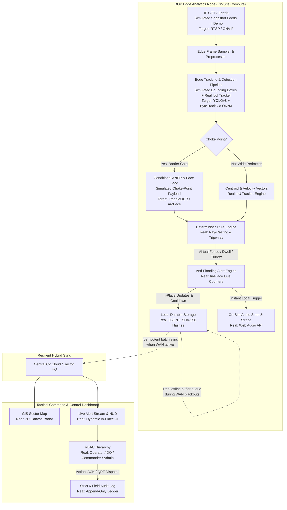

# IBVAP — Intelligent Border Video Analytics Platform
### Smart India Hackathon (SIH 2026) | Problem Statement: PS 26187 | Organization: SSB (Sashastra Seema Bal)

[](.github/workflows/ci.yml)
[](package.json)
[](IBVAP_RedTeam_Review.md)
[](data/audit_log.json)
[](LICENSE)

An **edge-first Command & Control (C2) and video analytics platform** designed specifically for remote Border Outposts (BOPs), check posts, and access roads along India's international borders. Built strictly following the deep architectural red-team analysis documented in [`IBVAP_RedTeam_Review.md`](file:///c:/Users/akhlad%20ali/Downloads/Project/IBVAP_RedTeam_Review.md).

> [!NOTE]
> **Prototype Implementation & Simulation Disclosure**:
> This repository implements a fully functional **Edge C2 Command & Control platform**, including an 8 Hz edge event loop, interactive zone drawing & calibration, a deterministic ray-casting rules engine, an anti-flooding alert aggregator with in-place duration counters, offline-resilient durable storage with idempotent batch sync, 4-tier RBAC, and a tamper-evident SHA-256 audit ledger.
> **Camera video feeds and deep-learning CV detections (YOLOv8/ByteTrack/ANPR) are simulated in this prototype** to demonstrate and validate the C2 architecture, data pipelines, and operator workflows without requiring on-site edge GPU accelerators or heavyweight machine learning runtime dependencies. Production deployment would integrate YOLOv8n/s and ByteTrack via ONNX Runtime / TensorRT on edge compute hardware (e.g., NVIDIA Jetson).

---

## Table of Contents
1. [Executive Summary & Problem Resolution](#1-executive-summary--problem-resolution)
2. [Core Architecture & Red-Team Engineering](#2-core-architecture--red-team-engineering)
3. [Data Sources & Benchmarking Catalog](#3-data-sources--benchmarking-catalog)
4. [Self-Contained SOP Operational Configuration](#4-self-contained-sop-operational-configuration)
5. [Legal & Governance Framework (RBAC & Audit Log)](#5-legal--governance-framework-rbac--audit-log)
6. [System Architecture Diagram](#6-system-architecture-diagram)
7. [Repository Structure](#7-repository-structure)
8. [REST & WebSocket API Reference](#8-rest--websocket-api-reference)
9. [Installation & Quick Start](#9-installation--quick-start)
10. [Interactive Verification & Testing Walkthrough](#10-interactive-verification--testing-walkthrough)
11. [Hardware Specifications & Bandwidth Economics](#11-hardware-specifications--bandwidth-economics)
12. [License & Disclaimers](#12-license--disclaimers)

---

## 1. Executive Summary & Problem Resolution

Traditional border surveillance systems produce overwhelming streams of raw video without automated triage, creating an unsustainable **human-attention bottleneck** where operators miss subtle breaches due to cognitive fatigue. Previous academic proposals made critical mistakes:
- Assuming **uniform CCTV quality** capable of Face Recognition and ANPR everywhere across wide-area borders.
- Relying on **centralized cloud streaming** over fragile, bandwidth-constrained border WAN links.
- Utilizing **black-box "behavior AI"** that yields unexplainable false positives.
- Generating **floods of duplicate alerts** on every frame for an ongoing loitering event.

### How IBVAP Solves This
1. **Edge-First Autonomy**: The 8 Hz edge event loop, lightweight multi-object tracking, deterministic rule evaluation, offline buffering, and siren triggers execute locally on edge nodes at each BOP, functioning continuously during total WAN blackouts. *(In this prototype, spatial-temporal detections are simulated to validate downstream edge C2 operations, and tracking runs via a pure-JS IoU tracker; production deployment targets YOLOv8n/s and full ByteTrack via ONNX Runtime / TensorRT on edge compute hardware).*
2. **Conditional Capabilities**: Realistic separation of wide-angle perimeter tracking from choke-point geometry (ANPR and Face matching are architected as strictly conditional capabilities isolated to vehicle barrier gates, preventing naive assumptions about wide-area CCTV optics; simulated in prototype at CAM-02).
3. **Decoupled SOP Rules Engine**: Operational thresholds (curfew hours, loiter dwell time, stationary duration) are decoupled from machine learning weights. Duty Officers update rules dynamically at runtime with **zero AI model retraining**.
4. **Anti-Flooding Alert Aggregator**: Aggregates continuous breach events into a **single persistent incident card with a real-time in-place duration counter** (`LIVE: 14s`), completely eliminating alarm fatigue.
5. **Tamper-Evident Chain-of-Custody**: Every snapshot, biometric crop, and operator intervention is cryptographically hashed with **SHA-256 digital signatures** and logged to an append-only audit trail for legal evidentiary standing.

---

## 2. Core Architecture & Red-Team Engineering

| Red-Team Finding | Naive Proposal Flaw | IBVAP Engineering Solution | Prototype Status vs. Production Target |
|---|---|---|---|
| **Computer Vision Inference (Sec 4 & 5)** | Claimed 8 Hz YOLOv8 deep-learning inference running locally without hardware sizing or runtime dependencies. | Architectural decoupling of detection inputs from the C2 rules engine. Downstream engines ingest standardized bounding-box telemetry (`[{ classLabel, bbox, confidence }]`), allowing the full C2 platform to operate without GPU dependencies while preserving production interface contracts. | **Simulated Prototype**: Camera video feeds and spatial-temporal bounding boxes are parametrically simulated in Node.js to validate downstream C2 rules, anti-flooding, and operator flows. (Production target: YOLOv8n/s via ONNX Runtime / TensorRT). |
| **Multi-Object Tracking (Sec 4 & 5)** | Claimed full production ByteTrack with Kalman filters and appearance re-ID without local implementation. | Lightweight pure-JS multi-object tracking engine implementing geometric IoU matching, centroid velocity vectors, 25-frame trajectory history, track aging, and dwell timing in `tracker.js`. | **Partial (ByteTrack-Inspired Heuristic)**: Functional pure-JS IoU tracker running locally at 8 Hz in `tracker.js`. (Production target: Full ByteTrack with Kalman filtering and two-stage association matching). |
| **Challenging Uniform CCTV (Sec 3 & 11)** | Claimed 4K ANPR & Face Recognition across all perimeter fences. | Recognizes optical realities: Wide-angle perimeter CCTV is physically incapable of reliable biometric recognition. ANPR and Face matching are conditional capabilities isolated to choke-point corridors with multi-frame confirmation. | **Simulated Prototype**: Mock choke-point metadata at CAM-02 barrier gate demonstrates conditional C2 gating and human verification workflows. (Production target: PaddleOCR / ArcFace on dedicated choke-point optics). |
| **Edge-First Local Storage (Sec 6 & 8)** | Streaming raw video over WAN to a central cloud datacenter. | 8 Hz edge processing loop runs 100% locally. Central synchronization uses an idempotent batch queue sending only lightweight metadata and hashed event packets (~420 Kbps vs 40 Mbps). | **Real C2 Engine / Simulated Video**: Real 8 Hz event loop, real offline buffer queue, and idempotent re-sync in Node.js. CCTV video feeds and telemetry are simulated via static backdrops and telemetry generators. |
| **Explainable Rules vs Black-Box AI (Sec 4 & 13)** | Opaque "suspicious behavior classification" neural networks. | Downstream deterministic rule engine: ray-casting point-in-polygon virtual fences, vector line-crossing directional tripwires, target velocity calculations, and curfew schedules. | **Real Implementation**: Fully functional ray-casting algorithm, CCW tripwire line-crossing intersection, curfew time interval parser, loiter dwell state tracking, and stationary vehicle detectors in `ruleEngine.js`. |
| **Anti-Flooding Vigilance (Sec 15)** | Generating 60 redundant alerts per second during a loitering event. | In-place duration updating. One continuous intrusion = One event card with live duration badge (`LIVE: 28s`). Post-event cooldowns prevent oscillation triggers. | **Real Implementation**: Fully functional in `alertEngine.js` with active incident tracking, in-place duration counters, WebSocket live broadcasts, auto-escalation, and post-event cooldown windows. |
| **Forensic Validity (Sec 16 & 25)** | Raw unverified image saves vulnerable to tampering in court. | Every evidentiary record generates a canonical SHA-256 hash stored in append-only storage and synchronized when WAN restores. | **Real Implementation**: Real SHA-256 cryptographic hash calculated for every incident record via Node.js `crypto` and stored in durable append-only ledger (`events.json`, `audit_log.json`). |

---

## 3. Data Sources & Benchmarking Catalog

IBVAP integrates and references four benchmark datasets to calibrate computer vision and geospatial mapping, as exposed via `/api/data-sources`:

1. **[VisDrone Benchmark Dataset](https://github.com/VisDrone/VisDrone-Dataset)**
   - *Domain*: High-angle mast, watchtower, and pole-mounted surveillance.
   - *Application*: Validates small-object detection under high-altitude oblique viewpoints where subjects occupy only 20–40 pixels on wide-area perimeter cameras (`CAM-01`).
2. **[BDD100K Dataset](https://github.com/bdd100k/bdd100k)**
   - *Domain*: Diverse driving and road video under adverse environmental conditions.
   - *Application*: Calibrates vehicle and pedestrian tracking across rain, dense fog, night glare, and dusk/dawn transitions representative of Himalayan and Terai border sectors (`CAM-03` and `CAM-04`).
3. **[UFPR-ALPR License Plate Dataset](https://web.inf.ufpr.br/vri/databases/ufpr-alpr/)**
   - *Domain*: Choke-point ANPR & multi-frame OCR.
   - *Application*: Validates multi-frame temporal consistency at vehicle inspection gates (`CAM-02`). Eliminates false readings caused by single-frame glare or dirt occlusion.
4. **[OpenStreetMap (OSM) Border GIS](https://www.openstreetmap.org/#map=5/21.84/82.79)**
   - *Domain*: Open border topography and geospatial coordinates.
   - *Application*: Supplies geospatial coordinates for Border Outposts (BOPs), zero-line coordinates, terrain contours, and road networks rendered on the live tactical radar canvas.

---

## 4. Self-Contained SOP Operational Configuration

Rather than requiring an external training dataset, IBVAP incorporates a **self-contained JSON configuration dataset** (`data/rules_config.json`):

```json
{
  "curfew": {
    "start": "22:00",
    "end": "05:30"
  },
  "intrusion": {
    "dwell_time": 5,
    "group_threshold": 3
  },
  "vehicle": {
    "stationary_limit": 6
  },
  "alert": {
    "ack_timeout": 30
  }
}
```

### Architectural Benefit: Zero AI Retraining
- **Decoupled Logic**: Changing operational rules (e.g., advancing curfew from `22:00` to `21:00`, or reducing dwell time from `5s` to `3s`) requires **zero retraining of upstream detection models (such as YOLOv8 or ByteTrack)**.
- **Instant Hot-Reload**: Changes applied through the C2 **SOP Rule Studio** take effect on the edge engine's subsequent 8 Hz frame cycle without restarting the process.
- **Audit-Logged**: Every parameter modification generates an immutable audit log entry recording who modified the policy, when, and the prior configuration state.

---

## 5. Legal & Governance Framework (RBAC & Audit Log)

> [!NOTE]
> **Prototype Policy Baseline Disclaimer**: The Role-Based Access Control matrix and data retention timelines below represent the project's **proposed prototype baseline** for system evaluation. They are explicitly labeled as prototype engineering policies and are **not** presented as official regulations of the Ministry of Home Affairs (MHA), Border Security Force (BSF), or Sashastra Seema Bal (SSB).

### Role-Based Access Control (RBAC) Hierarchy

```
RBAC
├── Operator (Frontline BOP Console Monitor)
│   ├── View real-time CCTV video & tactical GIS radar
│   ├── Acknowledge incoming operational alerts
│   └── Attach observation notes to incident records
├── Duty Officer (Shift Tactical Commander)
│   ├── All Operator capabilities
│   ├── Dispatch Quick Reaction Teams (QRT)
│   ├── Escalate or dismiss active security alerts
│   └── Read-only access to tamper-evident audit logs
├── Sector Commander (Sector Commanding Officer)
│   ├── All Duty Officer capabilities
│   ├── Override virtual fence boundaries & curfew restrictions
│   ├── Export cryptographically sealed forensic evidence dossiers
│   └── Full audit trail visibility across all sector outposts
└── System Administrator (Technical Edge Administrator)
    ├── Dynamic SOP configuration tuning (curfew, dwell, stationary)
    ├── Camera stream ingestion, lens calibration & zone drawing
    ├── Retention policy management
    └── Edge hardware telemetry & failover administration
```

### Strict 6-Field Chain-of-Custody Audit Log Schema

Every operator action, incident acknowledgment, and SOP modification is recorded into `data/audit_log.json` strictly conforming to the 6-field schema:

```
Audit Log
├── user_id       (e.g., "OP-SINGH-44", "DO-SSB-201", "ADMIN-SYS-99")
├── timestamp     (ISO-8601 UTC timestamp)
├── action        (e.g., "ACKNOWLEDGE", "DISPATCH_QRT", "CONFIGURE_SOP_RULES")
├── camera_id     (e.g., "CAM-01", "CAM-02", "GLOBAL_SYSTEM")
├── incident_id   (e.g., "EVT-1790459803041-507", "SYSTEM-RULE-CONFIG")
└── result        ("SUCCESS" | "FAILED" | "REJECTED_UNAUTHORIZED")
```

#### Proposed Prototype Retention Baseline:
- **Incident Evidence Dossiers**: Retained locally for **30 days** with SHA-256 digital seals.
- **Non-Incident Stream Metadata**: Telemetry and track history retained for **7 days**.
- **Audit Trails**: Retained for **365 days** in an append-only verifiable ledger.
- **Biometric Crops**: High-resolution face and plate crops are buffered in memory and purged within **48 hours** or upon incident disposition.

---

## 6. System Architecture Diagram



---

## 7. Repository Structure

```
IBVAP/
├── .github/
│   ├── workflows/
│   │   └── ci.yml               # GitHub Actions CI workflow
│   ├── ISSUE_TEMPLATE/
│   │   ├── bug_report.md        # Standardized bug reporting template
│   │   └── feature_request.md   # Architectural feature request template
│   └── pull_request_template.md # PR submission checklist
├── data/
│   ├── audit_log.json           # Tamper-evident 6-field audit trail
│   ├── data_sources.json        # Benchmarks, SOP config, and governance catalog
│   ├── events.json              # Local durable incident store
│   ├── rules_config.json        # Active SOP thresholds (curfew, dwell, stationary)
│   └── zones.json               # Configured virtual fences & tripwires
├── public/
│   ├── assets/                  # High-resolution surveillance snapshots
│   ├── css/
│   │   └── style.css            # Tactical dark-mode C2 defense styling
│   ├── js/
│   │   ├── app.js               # WebSocket client, RBAC, and modal controllers
│   │   ├── audioAlert.js        # Synthetic Web Audio API siren & alarms
│   │   ├── canvasRenderer.js    # 60 FPS HUD overlay renderer
│   │   ├── gisMap.js            # Tactical GIS sector radar
│   │   └── zoneDrawingTool.js   # Interactive polygon & tripwire drawing tool
│   └── index.html               # Main Tactical Command Center dashboard
├── server/
│   ├── engine/
│   │   ├── alertEngine.js       # Anti-flooding aggregator & duration updater
│   │   ├── cameraManager.js     # Camera stream manager & 8 Hz simulation loop
│   │   ├── ruleEngine.js        # Ray-casting point-in-polygon & tripwires
│   │   ├── storage.js           # Durable storage, SHA-256 hashing & sync
│   │   └── tracker.js           # Lightweight IoU multi-object tracker (ByteTrack-inspired)
│   ├── routes/
│   │   └── api.js               # REST API endpoints
│   └── server.js                # Express 5 & WebSocket server entrypoint
├── tests/
│   └── verify_system.js         # Automated core architecture validation test
├── .gitignore                   # Ignored files (node_modules, logs, temp)
├── CODE_OF_CONDUCT.md           # Contributor Covenant Code of Conduct
├── CONTRIBUTING.md               # Contribution guidelines & architectural rules
├── IBVAP_RedTeam_Review.md      # Ground-truth 26-point red-team review document
├── LICENSE                      # Apache License 2.0
├── package.json                 # Node.js project manifest & test script
├── README.md                    # Primary repository documentation
└── SECURITY.md                  # Security policy & vulnerability reporting
```

---

## 8. REST & WebSocket API Reference

### REST Endpoints
| Method | Endpoint | Description | Access Tier |
|---|---|---|---|
| `GET` | `/api/cameras` | List camera streams with hardware telemetry and capabilities. | All Roles |
| `GET` | `/api/cameras/:id/zones` | Fetch configured virtual fences and tripwires for a camera. | All Roles |
| `POST` | `/api/cameras/:id/zones` | Save calibrated virtual fences or tripwire coordinates. | Duty Officer+ |
| `GET` | `/api/alerts` | Query security alerts with optional filters (`camera_id`, `severity`). | All Roles |
| `POST` | `/api/alerts/:id/action` | Execute action (`ACKNOWLEDGE`, `DISPATCH_QRT`, `DISMISS`). | Operator+ |
| `GET` | `/api/rules/config` | Retrieve active decoupled SOP operational configuration. | All Roles |
| `POST` | `/api/rules/config` | Update SOP thresholds (`curfew`, `dwell_time`, `stationary_limit`). | System Admin |
| `GET` | `/api/data-sources` | Catalog of benchmark datasets, active SOP, and governance metadata. | All Roles |
| `GET` | `/api/governance` | RBAC clearance matrix and proposed prototype retention policy. | All Roles |
| `GET` | `/api/audit-logs` | Retrieve strict 6-field tamper-evident chain-of-custody audit logs. | Duty Officer+ |
| `POST` | `/api/system/wan-toggle` | Toggle WAN connectivity state for offline resilience testing. | System Admin |

### WebSocket Real-Time Stream (`ws://localhost:3000`)
- **Protocol**: JSON frames emitted at 8 Hz.
- **Payload Contents**:
  - `activeCameraId`: Currently selected camera ID.
  - `telemetry`: CPU, GPU, FPS, latency, and WAN status (simulated hardware telemetry in prototype).
  - `trackedObjects`: Real-time bounding boxes, persistent track IDs, velocity vectors, and dwell timers (generated by pure-JS IoU tracker from simulated detection inputs).
  - `alerts`: Active security incidents with in-place duration counters.
  - `zones`: Calibrated virtual fence polygons and tripwires.

---

## 9. Installation & Quick Start

### Prerequisites
- [Node.js](https://nodejs.org/) v18.0.0 or higher
- npm v9.0.0 or higher

### 1. Clone the Repository
```bash
git clone https://github.com/your-username/ibvap.git
cd ibvap
```

### 2. Install Dependencies
```bash
npm install
```

### 3. Run Automated System Validations
```bash
npm test
```
*Executes `tests/verify_system.js` to validate camera ingestion, dataset cataloging, decoupled SOP parameters, 6-field audit schemas, and SHA-256 cryptographic hashing.*

### 4. Start the Edge Platform
```bash
npm start
```
The Command & Control interface will be available at **`http://localhost:3000`**.

---

## 10. Interactive Verification & Testing Walkthrough

Open `http://localhost:3000` in your web browser to test all operational capabilities:

1. **Role-Based Access Control (RBAC)**:
   - Use the **`ROLE`** dropdown in the top header to toggle between `Operator`, `Duty Officer`, `Sector Commander`, and `System Administrator`.
   - Verify that trying to modify SOP parameters as `Operator` triggers a read-only clearance warning.
2. **Multi-Camera Matrix & Conditional Capabilities (Simulated Scenarios)**:
   - *(Note: Video backdrops and detection tracks are simulated operational scenarios demonstrating conditional choke point vs. perimeter behaviors without requiring edge GPU hardware.)*
   - Select **CAM-01** (Wide Perimeter Daylight) — Human tracking scenario active, ANPR disabled.
   - Select **CAM-02** (Barrier Choke Point) — Multi-frame ANPR active (`UP-55-AF-1084` at 88% confidence) and Face matching conditional lead.
   - Select **CAM-03** (Sector 4 Night IR) — Thermal IR mode with motion tracking.
   - Select **CAM-04** (Mountain Patrol Road) — Vehicle and pedestrian tracking along transit roads.
3. **Interactive Virtual Fence Calibration**:
   - In the operator toolbar, click **`+ Draw Virtual Fence`**.
   - Click 3 or more vertices on the camera viewport, then double-click to close the polygon.
   - Name your zone (e.g., `Restricted Boundary Zone`); the edge rule engine evaluates it immediately.
4. **Anti-Flooding Alert Aggregation**:
   - Observe the live incident stream on the right panel.
   - As an intruder stays inside the perimeter exclusion zone, observe that a single event card updates its live counter in place (`LIVE: 14s`, `LIVE: 15s`) instead of flooding 60 separate notifications.
5. **WAN Blackout Resilience Simulation**:
   - Click **`Simulate WAN Loss`** in the header.
   - The status pill transitions to **`WAN DOWN: LOCAL BUFFER ACTIVE`**.
   - Alerts continue firing locally, updating on-site sirens, and queuing in durable offline storage (`X EVTS (LOCAL)`).
   - Click **`Restore WAN Sync`** to trigger the idempotent batch sync to central storage.
6. **Chain-of-Custody Audit Log**:
   - Click **`Audit & Governance`** in the top navigation bar.
   - Inspect the live table displaying the strict 6 fields:
     `user_id | timestamp | action | camera_id | incident_id | result`.
7. **SOP Operational Rules Studio**:
   - Click **`SOP Operational Rules`** in the header.
   - Adjust `curfew.start`, `curfew.end`, `intrusion.dwell_time`, `intrusion.group_threshold`, or `vehicle.stationary_limit`.
   - Click **`Apply Parameters Instantly`**; updates apply to the edge engine without restarting the server or retraining any model.
8. **Real Tactical Mobile Recon Camera (CAM-MOBILE-01 Smartphone Live Feed & Alarm Buffer)**:
   - **Step 1: Discover Laptop LAN IP & Dynamic Info Route**:
     The server automatically detects the host's physical LAN IPv4 address via `os.networkInterfaces()` upon startup and exposes it at `/api/mobile-cam-info`:
     ```bash
     # Example detected LAN IP: 10.159.203.55
     # Or verify manually via:
     # Windows: ipconfig
     # Linux/macOS: ifconfig or ip a
     ```
   - **Step 2: Generate Local SSL Certificates** (Required for browser `getUserMedia` secure context policy):
     Run the automated setup script:
     ```bash
     npm run setup-certs
     ```
     This checks `certs/key.pem` and `certs/cert.pem` and generates a 2048-bit RSA certificate via OpenSSL if missing.
     - *Alternative (mkcert, automatically trusted without browser warnings)*:
       ```bash
       mkcert -install && mkcert 10.159.203.55 localhost
       mv 10.159.203.55+1-key.pem certs/key.pem
       mv 10.159.203.55+1.pem certs/cert.pem
       ```
     - *Fallback (OpenSSL Self-Signed)*:
       ```bash
       openssl req -x509 -newkey rsa:2048 -nodes \
         -keyout certs/key.pem -out certs/cert.pem -days 365 \
         -subj "/CN=10.159.203.55"
       ```
       > [!NOTE]
       > With self-signed certificates, the phone browser will show an interstitial security warning on first visit. Tap **"Advanced" > "Proceed to <LAN-IP> (unsafe)"**. This is expected and standard for local HTTPS development.
   - **Step 3: Port Architecture & URL Distinction**:
     - **HTTP Port 3000 (`http://localhost:3000` or `http://<LAN-IP>:3000`)**: Operator Command & Control (C2) dashboard.
     - **HTTPS Port 3443 (`https://<LAN-IP>:3443/mobile-cam`)**: Secure mobile camera client running TensorFlow.js COCO-SSD on the phone.
   - **Step 4: Connect Mobile Phone to Server via In-Page Modal**:
     - On the laptop dashboard (`http://localhost:3000`), click the **`+ Mobile Cam`** button in the top navigation bar.
     - An in-page modal opens (without navigating away from the dashboard) displaying:
       - Detected Laptop LAN IP and Secure Mobile URL.
       - A client-side generated **QR code** encoding `https://<LAN-IP>:3443/mobile-cam`.
       - Buttons to **Copy Mobile URL** (with copied feedback) or **Open on this Device (Preview Only)**.
       - A live **PHONE CONNECTION** telemetry row (`WAITING FOR PHONE` -> `CONNECTED` -> `STALE`).
     - On your smartphone (connected to the same Wi-Fi/hotspot):
       - Scan the QR code or open `https://<LAN-IP>:3443/mobile-cam`.
       - Accept the certificate warning (if using self-signed cert).
       - Tap **Allow** when camera permissions are requested.
     - Verify status indicators on phone:
       - **Camera Permission**: `● Granted`
       - **Camera Feed**: `● Active (1280x720)`
       - **AI Model**: `● COCO-SSD Ready`
       - **IBVAP Server**: `● Connected`
   - **Step 5: End-to-End Person Detection & Anti-Flooding Alarm**:
     - Have a person enter the phone camera frame:
       - Client runs on-device inference (`COCO-SSD` MobileNetV2) at ~175ms intervals using chained `setTimeout`.
       - Persons count updates to `1` with confidence percentage (e.g., `94%`).
       - Bounding boxes and labels draw locally on the phone's tactical viewfinder.
       - Phone transmits **ONLY JSON metadata** over secure WebSocket (`wss://<LAN-IP>:3443`). No raw video, canvas frames, or images ever cross the network.
       - Server logs: `[MOBILE] Detection received` and `[MOBILE] CAM-MOBILE-01 detections: 1`.
     - On the Laptop Dashboard (`http://localhost:3000`):
       - `CAM-MOBILE-01` card in the camera grid transitions from `STANDBY` to `ONLINE` with a `SMARTPHONE LIVE` badge.
       - The modal's live `PHONE CONNECTION` row updates to `CONNECTED` with live detection count and confidence score.
       - The anti-flooding engine (`alertEngine.js`) detects the full-frame `ZONE-MOBILE-01` virtual fence violation.
       - An incident card appears in the live alert stream with a running live duration counter (`LIVE: 1s`, `LIVE: 5s`...).
       - Tactical alert siren (`audioAlert.js`) sounds on the operator laptop through the unified alert audio pipeline.
     - When the person steps out of the camera view:
       - Detections clear (`0 persons`).
       - After `alertEngine`'s standard cooldown window, the incident transitions to `RESOLVED`, and the siren automatically stops.
       - If no detections are received for >3s, `CAM-MOBILE-01` transitions from `ONLINE` to `STALE`.

> [!NOTE]
> **Known Limitation (RBAC & Authentication)**:
> As documented across the project baseline in `SECURITY.md`, RBAC enforcement and CAM-MOBILE-01 feed association in this prototype are presentation- and client-side gated. Production deployment requires mutual TLS (mTLS), hardware TPM authentication, and backend session tokens for ad-hoc mobile reconnaissance nodes.

---

## 11. Production Target Hardware Specifications & Bandwidth Economics

> [!NOTE]
> **Prototype vs Production Deployment Context**: The prototype platform in this repository runs on standard Node.js without requiring GPU accelerators, enabling rapid local evaluation on commodity developer machines. The specifications below outline the recommended hardware sizing for fielding full ONNX/TensorRT edge pipelines at real border outposts.

### Recommended Edge Deployment Specifications (Per BOP Node)
- **Edge Compute Unit**: NVIDIA Jetson Orin Nano (8GB) / Orin NX (16GB) or Industrial PC with Intel Core i5/i7 + RTX 4060 GPU.
- **Power Envelope**: 15W–45W (compatible with BOP solar + battery backup systems).
- **Local Storage**: 512GB NVMe SSD (Endurance rated for continuous video and metadata circular buffering).
- **Streams Supported**: 4–8 RTSP H.264/H.265 1080p camera channels @ 15–20 FPS.

### Bandwidth Economics: Edge-First vs. Cloud Streaming
| Metric | Naive Central Streaming | IBVAP Edge-First Architecture |
|---|---|---|
| **Per-Camera Ingestion** | 4.0–8.0 Mbps continuous uplink | 0.0 Mbps uplink (processed on-site) |
| **BOP WAN Requirement (4 Cameras)** | 16–32 Mbps continuous dedicated link | < 450 Kbps intermittent metadata sync |
| **WAN Blackout Behavior** | Complete surveillance failure | 100% operational on-site; alerts buffered |
| **Cellular / SATCOM Cost** | > ₹1,50,000 / month per BOP | < ₹4,000 / month per BOP |

---

## 12. License & Disclaimers

### License
This project is licensed under the **Apache License 2.0**. See the [LICENSE](LICENSE) file for complete terms and conditions.

### Prototype Policy Baseline Disclaimer
The operational rules, retention periods, and access control policies implemented in this project represent an engineering prototype baseline developed for the **Smart India Hackathon 2026 (Problem Statement PS 26187)**. They are not official regulations or directives of the Ministry of Home Affairs (MHA), Border Security Force (BSF), or Sashastra Seema Bal (SSB).

### Benchmarking Attribution
This project references publicly available research benchmarks:
- **VisDrone**: [github.com/VisDrone/VisDrone-Dataset](https://github.com/VisDrone/VisDrone-Dataset)
- **BDD100K**: [github.com/bdd100k/bdd100k](https://github.com/bdd100k/bdd100k)
- **UFPR-ALPR**: [web.inf.ufpr.br/vri/databases/ufpr-alpr/](https://web.inf.ufpr.br/vri/databases/ufpr-alpr/)
- **OpenStreetMap**: [openstreetmap.org](https://www.openstreetmap.org/)
